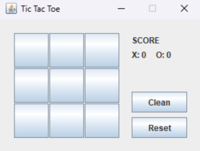

# Tic Tac Toe

**PT-BR**

Tic Tac Toe é o jogo da velha construído em Java com as bibliotecas AWT e Swing. A aplicação é voltada para a interação local entre dois jogadores e apresenta uma interface gráfica simples com a exibição do tabuleiro, placar e botões de configuração. Fiz este código com o propósito de fixar os conhecimentos adquiridos no final do terceiro semestre de BSI e desenvolver um algoritmo eficiente para verificar as posições marcadas e definir o jogador que venceu a rodada.
  

**EN**

Tic Tac Toe is a game built in Java with the AWT and Swing libs. The application is aimed at local interaction between two players and features a simple graphical interface with the display of the board, score, and configuration buttons. I created this code with the purpose of solidifying the knowledge acquired at the end of the third semester of BSI and developing an efficient algorithm to check the marked positions and determine the winning player of the round.
   

## :computer: Pré-requisitos

Para executar a aplicação é necessário, em ordem:
1. Instalar o Java JDK e JRE (neste caso, optou-se pelas versões 19 de ambos);
2. Baixar ou clonar este repositório;
3. Executar o arquivo "TicTacToe.java";
4. Iniciar a interação com a interface.
   

## :coffee: Como usar

Com a aplicação em execução, basta utilizar os botões disponíveis para realizar as jogadas. À esquerda, encontra-se o tabuleiro; enquanto que à direita, é possível visualizar o placar e os botões para reiniciar a partida ou limpar o histórico de jogadas. Uma vez que o jogo foi concebido para ser disputado entre duas pessoas, o turno alterna de maneira constante entre o jogador X e o jogador O.

  

